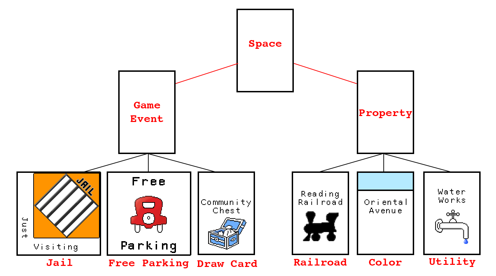

# Final Project: Java Monopoly Prototype

<figure>
    
</figure>

 

#### Table of Contents
1.  [Introduction](#introduction)
    1.  [Description](#description)
2.  [Data structures](#data-structures)
    1. [Spaces, properties, and game events](#spaces%2C-properties%2C-and-game-events)
3.  [Code organization](#code-organization)
4.  [Manipulation of data](#manipulation-of-data-structures)
5.  [User interface](#user-interface)

&nbsp;
### Introduction
This project seeks to implement a playable version of the board game Monopoly.

&nbsp;
### Data structures

#### Spaces, properties, and game events
A game of Monopoly can be decomposed into a single, large data structure, and this comprises the core of this project.

There are 40 spaces in a standard game of Monopoly. These can be categorized into several groups according to their behavior - the two primary groups are **properties** and **game events**.

&nbsp;

**Properties** are any spaces that a player may purchase. For example, *Mediterranean Avenue* and *Electric Company* are both properties, but *Free Parking* is not. All properties share some common attributes; players can purchase, mortgage, and trade them - but they can also charge rent when another player lands on them. The calculation of this rent is not uniform across properties, and is a key reason for further subcategorization.

Some properties belong to a **Color** group, such as *Park Place* and *Boardwalk* from the dark blue group. The only non-color properties on the board are **Railroads** and **Utilities**.

Each of these property groups have specific rules that determine the amount of rent that a player must pay when they land on them. Additionally, these calculations are dependent on the state of other spaces within the group. For example, a player must pay more rent if the owner possesses more than one railroad, or if a house is developed on a color property.

&nbsp;

**Game events** are any spaces that a player is not able to purchase. These include *GO*, *Jail*, and any draw-card spaces such as *Chance* or *Community Chest*.

These spaces also have specific rules that govern how the game state changes if a player lands on them. Examples: landing or passing on *GO* grants the player a $200 bonus, landing on *Chance* executes a random event from a predetermined set, and landing on *Free Parking* does nothing.

Similar to properties, game event spaces are also subcategorized into several groups. A key differentiating factor of game events, however, is that there exist several categories that are occupied by only one space. For example, there is only a single *Jail* space.

Some game event spaces are grouped together - these include **draw card** and **tax** spaces.

<figure>
    
<figcaption> A simplified representation of the Space data.<figcaption>
</figure>

 

#### Players

#### Aggregating spaces and players
The primary data element is the board, containing information about all players, spaces, and game events. However, this largely acts as a container for the state of the game, with some inputs and outputs that are validated and manipulated slightly. The manipulation of this data is delegated to the Controller class group.

&nbsp;
### Code organization

&nbsp;
### Manipulation of data
