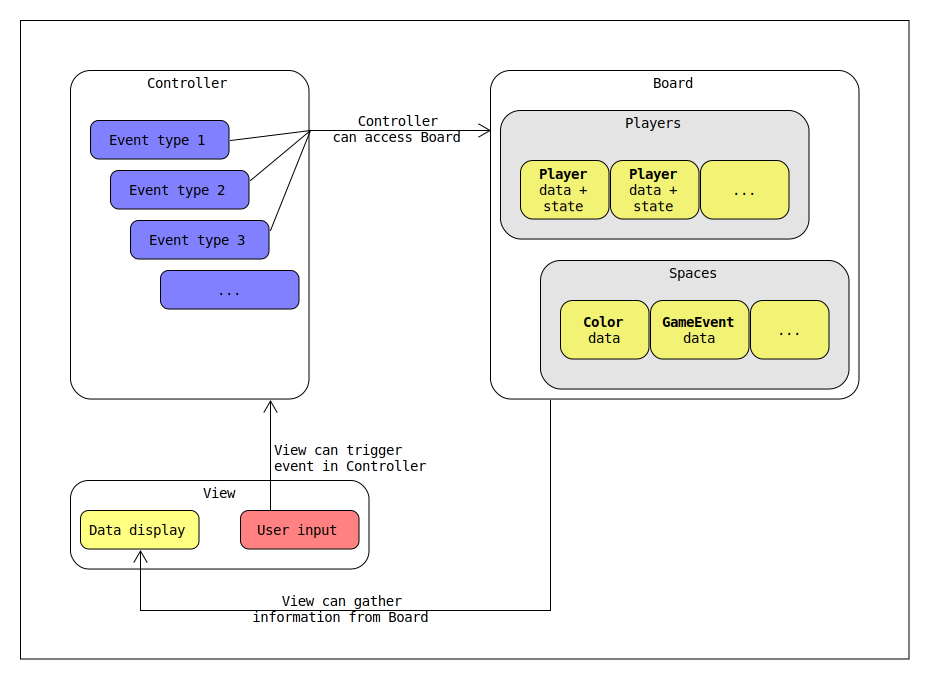
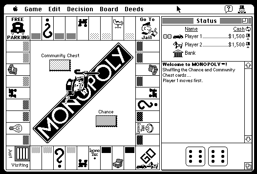

# Final Project: Java Monopoly Prototype

<figure>
    
</figure>

 

#### Table of Contents
1.  [Introduction](#introduction)
2.  [Data structures](#data-structures)
    1. [Spaces, properties, and game events](#spaces%2C-properties%2C-and-game-events)
    2. [Players](#players)
    3. [Aggregating spaces and players](#aggregating-spaces-and-players)
3.  [Code organization](#code-organization)
4.  [Manipulation of data](#manipulation-of-data-structures)
5.  [User interface - main components](#user-interface---main-components)
    1.  [Inspiration](#inspiration)
    2.  [General structure](#general-structure)
    3.  [Board view](#board-view)
    4.  [Information pane](#information-pane)
    5.  [Control pane](#control-pane)
    6.  [Animations and extra features](#animations-and-extra-features)
6.  [User interface - dialogs](#dialogs)
    1.  [Property purchase](#dialog-purchase-property)
    2.  [Jail](#jail)
    3.  [Game editor](#game-editor)
    4.  [Improvements](#improvements)
    5.  [Mortgage](#mortgage)
    6.  [Start game](#start-game)
7.  [Future features and ideas](#future-features)

&nbsp;
### Introduction
This project seeks to implement a playable version of the board game, Monopoly.

&nbsp;
### Data structures

#### Spaces, properties, and game events
A game of Monopoly can be decomposed into a single, large data structure, and this comprises the core of this project.

There are 40 spaces in a standard game of Monopoly. These can be categorized into several groups according to their behavior - the two primary groups are **properties** and **game events**.

&nbsp;

**Properties** are any spaces that a player may purchase. For example, *Mediterranean Avenue* and *Electric Company* are both properties, but *Free Parking* is not. All properties share some common attributes; players can purchase, mortgage, and trade them - but they can also charge rent when another player lands on them. The calculation of this rent is not uniform across properties, and is a key reason for further subcategorization.

Some properties belong to a **Color** group, such as *Park Place* and *Boardwalk* from the dark blue group. The only non-color properties on the board are **Railroads** and **Utilities**.

Each of these property groups have specific rules that determine the amount of rent that a player must pay when they land on them. Additionally, these calculations are dependent on the state of other spaces within the group. For example, a player must pay more rent if the owner possesses more than one railroad, or if a house is developed on a color property.

&nbsp;

**Game events** are any spaces that a player is not able to purchase. These include *GO*, *Jail*, and any draw-card spaces such as *Chance* or *Community Chest*.

These spaces also have specific rules that govern how the game state changes if a player lands on them. Examples: landing or passing on *GO* grants the player a $200 bonus, landing on *Chance* executes a random event from a predetermined set, and landing on *Free Parking* does nothing.

Similar to properties, game event spaces are also subcategorized into several groups. A key differentiating factor of game events, however, is that there exist several categories that are occupied by only one space. For example, there is only a single *Jail* space.

Some game event spaces are grouped together - these include **draw card** and **tax** spaces.

<figure>
    
<figcaption> A simplified representation of the Space data.<figcaption>
</figure>

 

#### Players

The data for each player is largely independent, not requiring the same degree of intra-object dependence such as that which may exist across space groups.

Additionally, some data is not as cleanly organized into the "space" or "player" domain - namely, the ownership of a property. This data is useful when held in the property object itself, but there are scenarios where finding the properties owned by a specific player is required. The aggregation of space and player data into a single "board" domain proves useful for this reason.

&nbsp;

#### Aggregating spaces and players
The primary data element is the board, containing information about all players, spaces, and game events. However, this largely acts as a container for the state of the game, with some inputs and outputs that implement simple validation and manipulation. More advanced manipulation and analysis of this data is delegated to the Controller class group.

A positive consequence of composing this data as a single class is the ability to query information across domains. As an example: suppose some representation of the game state must be updated, after a player has purchased the final property in the green color group, while owning the others within the set.

If we wish to determine if a player owns this green color group monopoly, there are two general approaches to query this data:

**1 - Query the player set**
- Create a set of values indicating the total number of green properties owned by each player.
    - For each player in the game, check if they own a property with the following attributes:
        - belongs to the *green* color group
    - If this matches, add to the respective total.
- Compare the totals. If only one of the totals is non-zero, all *owned properties* within that color set belong to a single player.

A problem arises when considering that a player may own 2 out of 3 spaces in a single color group, where all other players own none. This necessitates further querying of the space data, determining how many spaces exist in the group total.

&nbsp;

**2 - Query the space set**
- Create a set of values indicating the owners of each green property.
    - For each space in the game, check if the following conditions apply:
        - belongs to the *green* color group
        - is owned by a player
    - If this matches, set the appropriate owner value for the property.
- Compare the values. If all values are equal, the full set is owned by the player.

&nbsp;

The general algorithm for determining this data is similar across the domains, but becomes messy when it is frequently access across multiple classes and contexts. An alternative approach exists - the board itself can be queried specifically, through some specialized methods:

**1 - Obtain the set of all spaces owned by player *n***
 - For each space in the game, check if the following conditions apply:
    - owned by player *n*
- If this matches, add the space to the set.
- Return the set.

&nbsp;

**2 - Obtain the set of all spaces belonging to color group *g***
- For each space in the game, check if the following conditions apply:
    - within color group *g*
- If this matches add the space to the set.
- Return the set.

&nbsp;

The latter approaches of board-domain querying allow for cleaner access to attributes of the game state. Additionally, much of the need for this querying is eliminated as the board class can automatically self-update the relationships between its data members when the game state changes, using similar methods internally.

&nbsp;

### Code organization

Components of the application are roughly grouped into three categories:

**View**: displays the current game state to the user, and allows them to interact with it in a controlled manner

**Data**: contains information about the game state

**Controller**: modifies the game state according to specific rules and user input

An important note is that these categories are not occupied by single classes or objects, rather, responsibilities are delegated into smaller classes with some overlap.

<figure>
    
    <figcaption> A simplified view of the data and access structure.</figcaption>
</figure>

 

&nbsp;

### Manipulation of data

Classes belonging to the **Controller** group are responsible for manipulating the game state, enforcing the game rules, and regulating the flow of available interactions. 

&nbsp;

### User interface - main components

Classes belonging to the **View** group are responsible for displaying the state of the game to the user, and routing user input to any corresponding actions within Controller group classes.

&nbsp;

#### Inspiration

The user interface for this application is inspired and informed by [a commercial implementation](https://archive.org/details/MonopolyMacPlay) of the game - <i>Monopoly</i> (1993) by MacPlay, for the original Macintosh platform.

<figure>
    
    <figcaption> A screenshot of <i>Monopoly</i> on the Macintosh.
</figure>

 

A key attribute of this implementation is the simplicity of the user interface - given that the Macintosh has a resolution of 512x342 with 2 colors, this serves as a good template for a simpler design.

&nbsp;

#### General structure

Visually, the user interface is comprised of a main window, with a set of dialogs that hide/show when appropriate. This main window consists of three sub-windows: the board, information, and control sections.

<figure>
    
</figure>

 

#### Board view

The board view provides a visualization for the spaces on the board, acting as a proxy for a physical printed board. Each space is a button that, when pressed, updates a space information area. 

<figure>
    
</figure>

 

&nbsp;

#### Information pane

The information pane provides a single visual area for any player to assess the state of the game.

<figure>
    
</figure>

 

It consists of four information modules, each assigned to one player. These modules are then subdivided into **status** and **asset** views.

The **status** view, on the left, contains the following icons that indicate
-   - if it is currently the player's turn
-   - if the player is jailed
-   - if the player is bankrupt

as well as labels to indiate:
-  [ *Player n* ] - the player's name
-  [ *$____* ] - the current balance of the player
-  [ *space* ] - the name of the space that the player's game piece is currently on

&nbsp;

The **asset** view, on the right, contains icons with an associated numerical value. These include:

-  - the total number of properties owned by the player
-  - the number of Get Out of Jail Free Cards owned by the player
- , , etc. - the number of properties belonging to each group owned by the player

The text of the property group labels additionally changes colors depending on the state: gray when no properties are owned, and red when all properties are owned. (i.e., a monopoly)

&nbsp;

#### Control pane

The control pane provides important information about the current player, buttons to access optional dialogs (see section [Optional dialogs](#optional-dialogs)), and buttons to roll the dice and end their turn.

Note how the "Roll dice" and "End turn" buttons lock and unlock in response to the game state. Each player has an attribute, manipulated by the controller, that indicates if a player is permitted to perform either of these actions.

For example, it is not legal within official game rules for a player to end their turn if they have not rolled the dice; this also applies when rolling doubles.

&nbsp;

The six buttons in the center of the dialog allow the user to perform *optional* actions -- that is -- any actions that are not strictly required by the game rules. These include:
- mortgaging properties
- viewing owned properties
- managing improvements
- viewing statistics (not yet implemented)
- trading with other players (not yet implemented)
- forfeiting the game

#### Animations and extra features

Additionally, some spaces support animated assets that, when the mouse enters the space area, will replace the standard button appearance until the mouse exits. These spaces include:
- Electric Company
- Water Works
- Free Parking
- Go To Jail
- Luxury Tax

    

### User interface - dialogs

Some user interface elements have specific contexts where their visibility is required, in contrast to the always-shown board, information, and control views of the main window. Such user interface elements are implemented with **dialogs**, and these are split into two categories: **mandatory**, which allow responses to required actions, and **optional**, which can be summoned by the user in nearly any game state context.

**Mandatory** dialogs include the property purchase and jail dialogs. A user cannot dismiss these, as a decision is required to continue the game.

 

<video width="320" height="240" controls>
  <source src="movement-anim.mov" type="video/mov">
</video>
