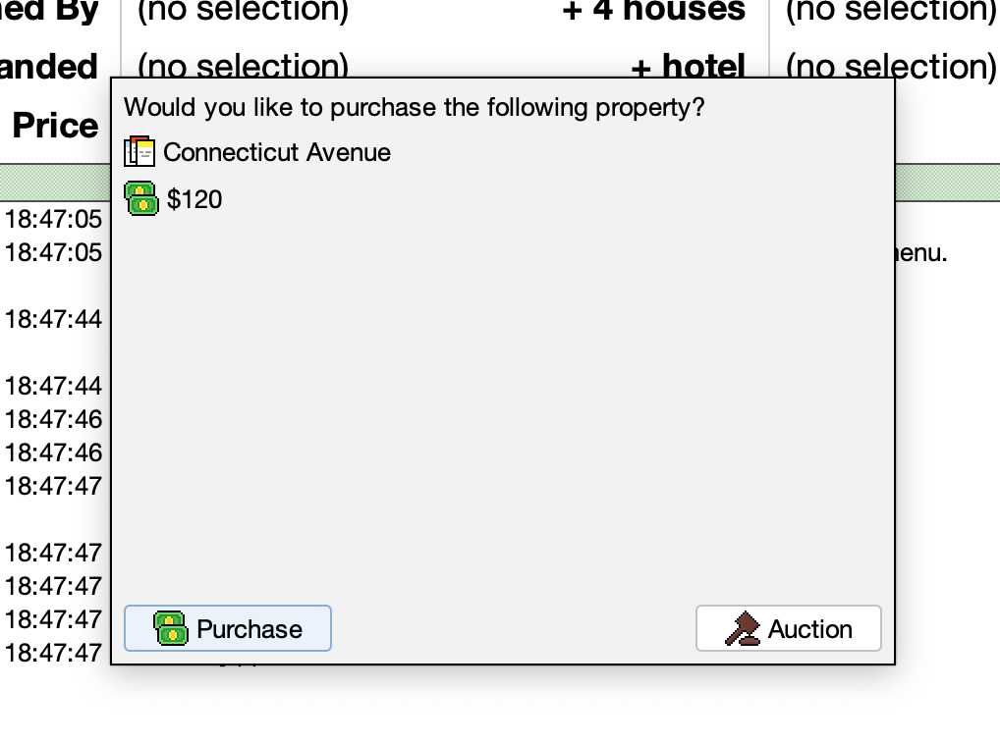

# Project Proposal: Java Monopoly Prototype
---

<figure>
    
</figure>

 

**Description**

The program seeks to implement a playable version of the board game, Monopoly.

&nbsp;

## Problems to solve

**Data**

A game of Monopoly can be decomposed into a single, large data structure, and this comprises the core of this project. A set of objects which contain certain attributes are affected throughout gameplay, either randomly, or by user decision.

The primary element of the game data is the board. It contains information about both the players and board spaces. Both the players and spaces are represented in an `ArrayList`. In the case of spaces, this `ArrayList` can contain several different object types, all derived from the base `Space` class. Consequently, each space can have its own methods that are called during a generic event, e.g., calculating rent.

<figure>
    
<figcaption> The full UML diagram for the project.  If you are unable to read this clearly, the full size image is available as <code>main-uml.svg</code> or <code>main-uml.png</code>.<figcaption>
</figure>

 

*The data structure is of maximum priority for this project.* Its implementation is essential to the remainder of the project's functionality, and is the most demonstrative of object-oriented principles covered in this course.

---
&nbsp;
**Representing and manipulating data**

<figure>
    
    <figcaption> A simplified view of the data and access structure.</figcaption>
</figure>

 

The primary structure of the program is demonstrated in the above diagram. It uses elements of MVC (model, view, controller) structures, but is not necessarily defined as one.

- `Board` contains the game data, with only basic logic implementation.
- `Controller` provides an interface for user input to be converted into an altered game state. It contains the majority of logic for the application, including the code which implements game rules and enforcement.
- `View` provides an interactive and graphical representation of the current game state. It allows the player to perform an action from a set whose restrictions are context-dependent on the game state.

---
&nbsp;

**CPU players**

Implementing an extremely basic CPU player is not difficult, wherein the player automatically performs its necessary actions, and executes any required decision as `true`.

A more advanced CPU player can be manifested through several styles:

<u>Random probability</u>: For each mandatory binary decision that the player encounters, a probability is assigned to one option. When an action is required, the execution of this decision is dependent on its probability. This effectively makes all actions random, where the probability could be determined at the start of the game by a seed.

<u>Basic statistical model</u>: When running simulations of Monopoly, particular patterns begin to appear. For example, the Jail space is often a 'trap' for players - this means that the spaces immediately following the Jail space have the highest probability of landing out of any other spaces on the board.

As a consequence of this land-probability distribution, some properties have a measurably higher return on investment (ROI) when improvements are constructed on them.

A statistically-based CPU player could make decisions similarly to that of the random probability model, but with a multiplicative factor based on the estimated ROI of a particular space.

<u>Machine-learning model</u>: While an ML-based model would undoubtedly perform very well compared to the other models listed, this is simply out of scope for this project. An implementation could be possible by using a relatively simple training method such as (framework here)

An important note to make is that much of a player's success in Monopoly is simply luck. The dice roll is the primary engine of the game, and there is an inherent amount of randomness that cannot be surpassed entirely with skill. One benefit to this is that the ability of any CPU player is not entirely dependent on its code - the luck will sometimes skew the game state in its favor regardless.

*The inclusion of a CPU player is of low priority for this project.* It would certainly improve the program, but is not essential.

---
&nbsp;

**Synchronization between objects**

Given that the `Board`, `Controller`, and `View` classes comprise the core of the game, an issue arises regarding how they should interact.

This is resolved by allowing the view to inherit the controller, enabling any user input to be validated and sent to the controller when appropriate. Once a method from the controller is finished executing, the view updates itself by accessing the now-modified contents of the board. Effectively, this creates a system where actions only occur when strictly necessary; there is no "main game loop" in the application.

---
&nbsp;

## Technologies needed

**Data**

The primary data of the application is stored in a single serializable class, `Board`. This class can then be saved to a file to preserve the game state, and can be used by a future instance of the program to resume gameplay. Basic file I/O is needed as a result of this functionality.

Supplementary data is required for the program, such as property costs, names of spaces, and Community Chest/Chance card event data. This data is static during the execution of the program, and is not intended to be modified. It can be loaded from a file format such as `.csv`, and then loaded into appropriate class attributes.

File I/O exceptions will need to be handled for both of these operation types.

---
&nbsp;

**User interface**

The user interface for this application is inspired and informed by [a commercial implementation](https://archive.org/details/MonopolyMacPlay) of the game - <i>Monopoly</i> (1993) by MacPlay, for the original Macintosh platform.

<figure>
    
    <figcaption> A screenshot of <i>Monopoly</i> on the Macintosh.
</figure>

 

A key attribute of this implementation is the simplicity of the user interface - given that the Macintosh has a resolution of 512x342 with 2 colors, this serves as a good template for a simpler design.

---

In the Java implementation, a GUI front-end is provided to the user. This indicates much of the essential information needed for gameplay, including:
- All properties and game event spaces that exist on the board
- Position of each player
- Balance of each player
- Whose turn it is
- Whether a specific property is owned, and if so, by whom
- A log containing information about all previous turns, and the actions taken during those turns

<figure>
    
    <figcaption> An abstract diagram of how the user interface interacts with the data of the program.<figcaption>
</figure>

 

The key technology required for the GUI is Java Swing.

*The visual representation of data is of medium priority for this project.* The game can still be played without it, provided that a more primitive representation was given. 

---

The GUI provides mechanisms for controlling this core data structure of the game. Examples of actions through this interface include:
- Rolling dice
- Ending turn
- Viewing information about a specific property

Additionally, the GUI has several elements that provide simpler functions, and these can be displayed either automatically or manually.

Automatic elements are necessary when it is mandatory that a player takes action. Examples include:
- When landing on a property, asking the player if they wish to purchase or auction a property
- When jailed, asking the player if they wish to post bail, roll for doubles, or use a *Get Out of Jail Free Card*.

Manual elements are provided for optional actions. It is often useful to perform validation on a given selection, and to ask for confirmation. Examples include:
- Mortgaging properties
- Displaying which properties the player currently owns
- Constructing improvements (houses, hotels)
- Viewing statistics about the current game
- Trading with another player
- Forfeiting the game
---
Below are some sample screenshots from an early build of the game, demonstrating the different  types of GUI elements needed. Not all required elements are included, but the basic structure is present:

 

<figure>
    
    <figcaption> The primary user interface for the game. <figcaption>
</figure>

 

 

<figure>
    
    <figcaption> A prompt that the user must respond to when they land on a property that is not owned. <figcaption>
</figure>

 

 

<figure>
    
    <figcaption> A utility window primarily for debugging purposes, allowing the user to edit attributes of the current game. <figcaption>
</figure>

 

---

